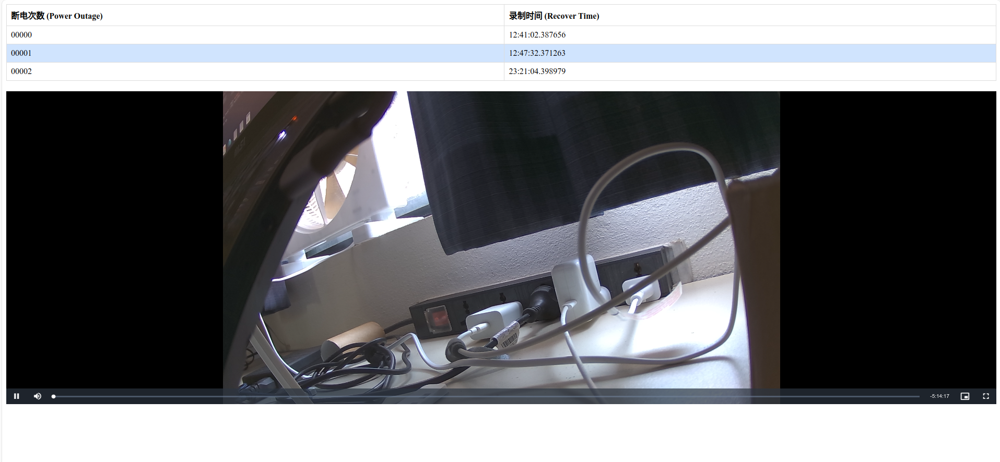

# Luckfox Pico MD (Motion Detection) MotionSense

## Project Update Log
+ ver 0.0.1
1. First version, "Bobtail Lizard".

# MotionSense Demo

**MotionSense** is a simple motion detection and video streaming solution built on the Luckfox Pico RV1106 platform. It dynamically adjusts the video frame rate, capturing at 1 fps under normal conditions and ramping up to 20 fps when motion is detected, based on customizable thresholds. The system supports both recording and live streaming functionalities. The project also integrates with a lightweight web server(Mongoose), managing video artifacts through an on-board SQLite database to store metadata, and log events such as motion detection, reboots, and power recoveries.

## Key Features

+ **Motion Detection:** Uses IVS (Intelligent Video Surveillance) modules to detect motion.  
+ **Video Capture & Encoding:** Captures frames from camera sensors, encodes them using H.264, and store files in HLS format.  
+ **Storage Management:** Manages video storage on SD cards, by organizing files into clearly structured folders based on date and log event times, and space cleanup routines.  
+ **Web Server & Database:** Streams video via HTTP and logs motion events in SQLite databases for easy retrieval.  

> For development and usage details, please refer to the source code in the `src` folder and documents in the `docs` folder.

## Future Plants
+ Optimize web server code, or switch to a different webserver (e.g. Goahead, uhttpd).
+ Optimize the heatmap stytle, the web server front end.
+ Optimize the file writing, may use Asynchronous IO in future.
+ Add OSD, add timestamp watermarks to the top left corner of the video.
+ Finish the player-bar marking feature, to help user nevigate motion spots by video progress bar.

## Known Issues
+ Mongoose will pop out socker error when autofreshing video streamer page or caching .ts files.
+ Failed to achieve the target frame rate, such as 30fps.
+ PTS (Presentation Time Stamp) and DTS (Decoding Time Stamp) are not accurate.