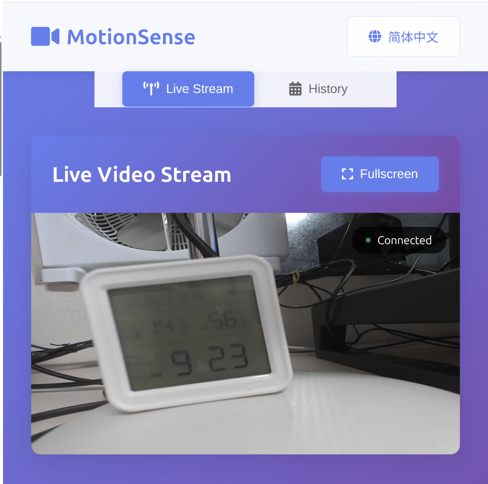
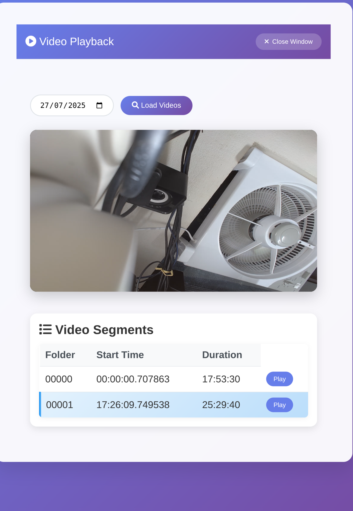
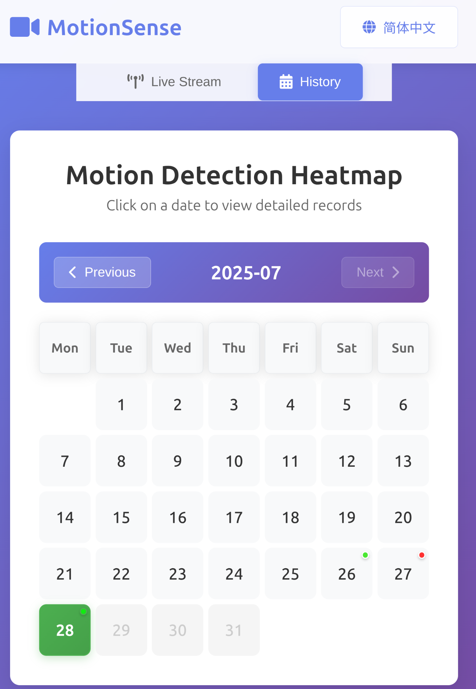

# Luckfox Pico MD (Motion Detection) MotionSense

## Project Update Log

+ ver 0.0.1

1. First version, "Bobtail Lizard".

# MotionSense Demo





**MotionSense** is a simple motion detection and video streaming solution built on the Luckfox Pico RV1106 platform. It dynamically adjusts the video frame rate, capturing at 1 fps under normal conditions and ramping up to 20 fps when motion is detected, based on customizable thresholds. The system supports both recording and live streaming functionalities. The project also integrates with a lightweight web server(Mongoose), managing video artifacts through an on-board SQLite database to store metadata, and log events such as motion detection, reboots, and power recoveries.

## Key Features

+ **Motion Detection:** Uses IVS (Intelligent Video Surveillance) modules to detect motion.
+ **Video Capture & Encoding:** Captures frames from camera sensors, encodes them using H.264, and stores files in HLS format.
+ **Storage Management:** Organizes video files in date-based folders with automated space cleanup routines.
+ **Web Server & Database:** Streams video via HTTP and logs motion events in SQLite databases for easy retrieval.

> For development and usage details, please refer to the source code in the `src` folder and documents in the `docs` folder.

## Hardware/Environment Requirements

+ **Tested and verified on Luckfox Pico Pro Max**
+ **SD card requirements: ext4 filesystem, minimum 4GB storage**
+ **Mount point `/mnt/sdcard` must be available before running MotionSense**
+ **RKIPC must be installed in default**

## Installation

### Prerequisites

+ **Host machine: x86-64 Linux desktop with VS Code installed**
+ **USB connection to Luckfox Pico board**

### Development Environment Setup

1. **Clone this repository:**
   ```bash
   git clone https://github.com/zhu30844/MontionSense.git
   cd MontionSense
   ```

2. **Open with VS Code Dev Container:**
   - Open the project folder in VS Code
   - When prompted, click "Reopen in Container" or use the command palette (Ctrl+Shift+P) and select "Dev Containers: Reopen in Container"
   - The development container includes all necessary build tools and cross-compilation environment

3. **Build the project:**
   ```bash
   ./build.sh
   ```

### Build Options

The `build.sh` script supports the following arguments:

+ **`./build.sh`** - Builds the project and deploys to the connected board
+ **`./build.sh clean`** - Cleans build artifacts and install directories
+ **`./build.sh run`** - Builds and pushes the binary to the board via ADB

### Deployment

1. **Connect your Luckfox Pico board via USB**
2. **Ensure ADB is connected:**
   ```bash
   adb devices
   ```
3. **Run the build script:**
   ```bash
   ./build.sh
   ```
4. **The script will automatically:**
   - Build the project using CMake
   - Push the compiled binary to `/mnt/sdcard/MotionSense/`
   - Push web assets to the board
   - Set executable permissions
   - Launch the application

### Manual Deployment (if needed)

If you need to manually deploy the application:

```bash
# Build the project
mkdir -p build && cd build
cmake .. && make install

# Deploy to board
adb push install/MotionSense /mnt/sdcard/
adb push www /mnt/sdcard/MotionSense/
adb shell chmod +x /mnt/sdcard/MotionSense/MotionSense

# Run the application
adb shell ./mnt/sdcard/MotionSense/MotionSense
```

## Dependencies

+ All dependencies are either compiled into libraries in the *lib* folder or included in the integrated toolchain.

## Future Plans

+ Optimize web server code, or switch to a different webserver (e.g. Goahead, uhttpd).
+ Optimize the heatmap style, the web server front end.
+ Optimize the file writing, may use Asynchronous IO in future.
+ Add OSD, add timestamp watermarks to the top left corner of the video.
+ Finish the player-bar marking feature, to help user navigate motion spots by video progress bar.
+ Create a Docker image for automated command-line compilation and CI/CD pipeline integration.

## Known Issues

+ Mongoose will pop out socket error when autofreshing video streamer page or caching .ts files.
+ Failed to achieve the target frame rate, such as 30fps.
+ PTS (Presentation Time Stamp) and DTS (Decoding Time Stamp) are not accurate.
