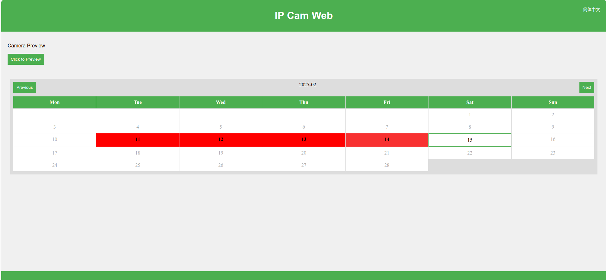

# Luckfox Pico MD (Motion Detection) MotionSense

## Project Update Log

+ ver 0.0.1

1. First version, "Bobtail Lizard".

# MotionSense Demo

**MotionSense** is a simple motion detection and video streaming solution built on the Luckfox Pico RV1106 platform. It dynamically adjusts the video frame rate, capturing at 1 fps under normal conditions and ramping up to 20 fps when motion is detected, based on customizable thresholds. The system supports both recording and live streaming functionalities. The project also integrates with a lightweight web server(Mongoose), managing video artifacts through an on-board SQLite database to store metadata, and log events such as motion detection, reboots, and power recoveries.

## Key Features

+ **Motion Detection:** Uses IVS (Intelligent Video Surveillance) modules to detect motion.
+ **Video Capture & Encoding:** Captures frames from camera sensors, encodes them using H.264, and stores files in HLS format.
+ **Storage Management:** Organizes video files in date-based folders with automated space cleanup routines.
+ **Web Server & Database:** Streams video via HTTP and logs motion events in SQLite databases for easy retrieval.

> For development and usage details, please refer to the source code in the `src` folder and documents in the `docs` folder.

## Hardware/Environment Requirements

+ **Tested and verified on Luckfox Pico Pro Max**
+ **SD card requirements: ext4 filesystem, minimum 4GB storage**
+ **Mount point `/mnt/sdcard` must be available before running MotionSense**

## Installation 

+ **Make sure your host machine is running x86-64 linux desktop and VScode is installed**
+ **Clone Luckfox SDK**
+ **Clone this repo inside the SDK folder**
+ **Copy the *.devcontainer* folder to the root of SDK**
+ **Open the SDK folder with VS Code and reopen the folder with the plugin *devcontainer***
+ **Switch to the project folder and run *build.sh***
+ **You can run the build.sh with the argument *clean* or *run (Pushes the binary file to the board via ADB)***
+ For more information about cross-compiling and environment set-up, please refer to the Luckfox wiki

## Dependencies

+ All dependencies are either compiled into libraries in the *lib* folder or included in the Luckfox SDK.

## Future Plans

+ Optimize web server code, or switch to a different webserver (e.g. Goahead, uhttpd).
+ Optimize the heatmap style, the web server front end.
+ Optimize the file writing, may use Asynchronous IO in future.
+ Add OSD, add timestamp watermarks to the top left corner of the video.
+ Finish the player-bar marking feature, to help user navigate motion spots by video progress bar.
+ Create a Docker image for automated command-line compilation and CI/CD pipeline integration.

## Known Issues

+ Mongoose will pop out socket error when autofreshing video streamer page or caching .ts files.
+ Failed to achieve the target frame rate, such as 30fps.
+ PTS (Presentation Time Stamp) and DTS (Decoding Time Stamp) are not accurate.
