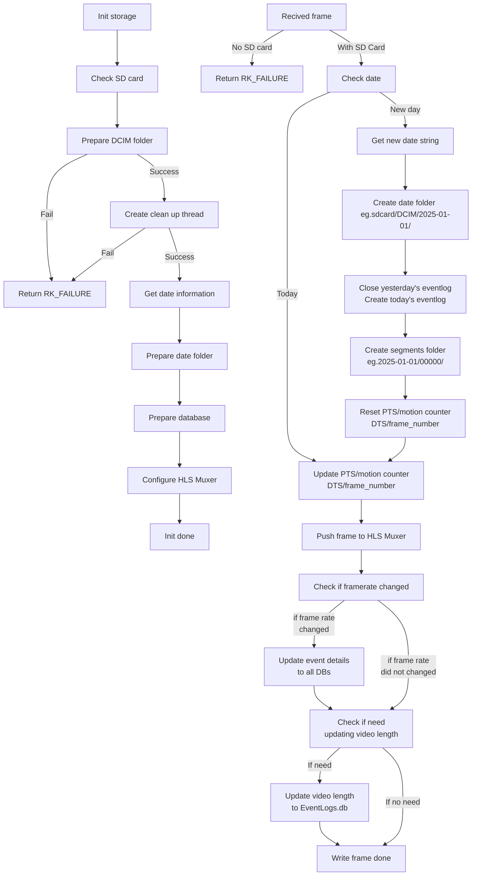

# Storage System Design

## Functional requirements
1. Save video in HLS format.
2. Do not drop any frame in ts buffer.
2. Handle the changing input frame rate. 
    + Saved video must be played in a fixed frame rate.
3. Orchestrate the folders.
    + Ensure video files are saved in order after power outage.
4. Utilize databases to record events and video information.
5. Free up disk space if SD card is almost full.
6. Video deletion.
    + Do not damage the integrity of the video. 
        - If there is only one day in record, do not delete any file though free disk is riching THRESHOLD.
        - Make sure delete the **ALL** sub folders and files of **ONE DAY** if deletion is performed.

## Non Functional requirements
1. Reduce disk IO. 
    + Frequency of storage detetion.
    + Frequency of database operations.

## Directory Tree 
```
sdcard
    │
    └─ DCIM
        │
        ├─ 2025-02-09
        │       │
        │       ├─ 00000 
        │       │    ├─ 00001.ts
        │       │    ├─ 00002.ts
        │       │    ├─ 00003.ts
        │       │    └─ index.m3u8
        │       ...
        │       │
        │       ├─ 00009
        │       │    ├─ 00001.ts
        │       │    ...
        │       │    ├─ 09999.ts
        │       │    └─ index.m3u8
        │       │
        │       └─ EventLogs.db
        │
        ├─ 2025-02-10
        │
        └─ VideoMetadata.db
```

## Simplified Flowchart 



## Media-server
[GitHub Link](https://github.com/ireader/media-server.git)
We only used two sub libraries, `hls` and `mpeg`, to encapsulate ts and m3u8 files. So we do not have to build and install dependencies of Media-server.
