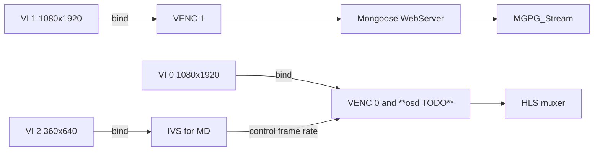

# Video System Design

## Video Pipelines

```mermaid
graph LR
    VI0[VI 0 1080x1920] -->|bind| VENC0[VENC 0 and **osd TODO**] --> HLS[HLS muxer]
    VI1[VI 1 1080x1920] -->|bind| VENC1[VENC 1] -->WebServer[Mongoose WebServer] --> MGPG_Stream[MGPG_Stream]
    VI2[VI 2 360x640] -->|bind| IVS[IVS for MD] -->|control frame rate| VENC0
```
